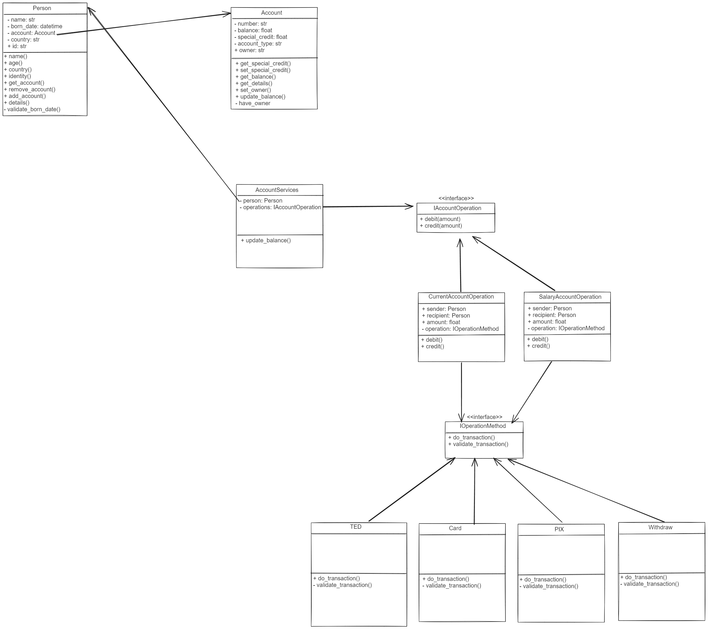
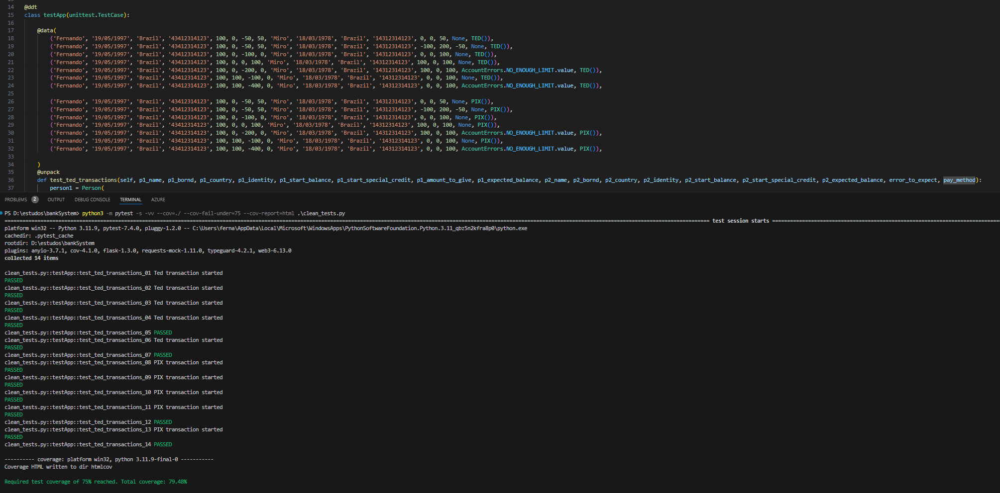
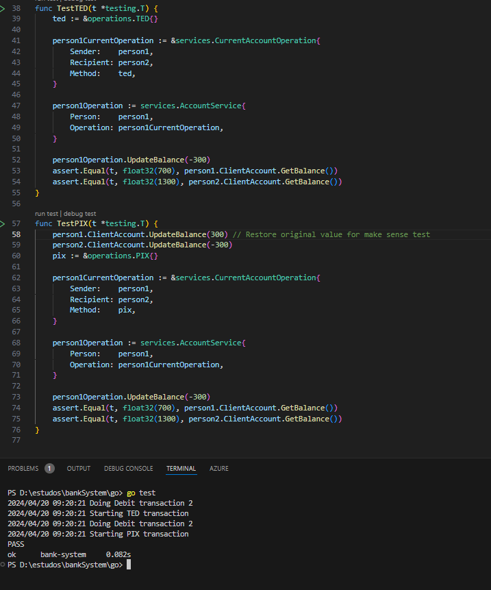

# Sistema bancário

Projeto para simular um ecossistema bancário com suas extremidades, validando o fim a fim da transação por inúmeros metodos diferentes (TED, PIX) com validação de cheque especial.
Desenvolvido em GOLang e Python

# Design
- Abstrai as funcionalidades especificas e regras de cada meio de pagamento(TED, PIX, Cartão, maquininha)
- Garante a escalabilidade de novas operações bancárias, novos sistemas de pagamentos sem alterações significativas no código
- Sem interação com banco de dados e/ou inputs externos, testado apenas com testes unitários para efeitos de estudos.

# UML

# RoadMap
- Implementar gravação e leitura de estados das entidades e informações bancárias em um banco de dados, junto com suas operações(atualizar saldo, etc).
- Implementar inputs externos para simular realmente uma interface de um app de banco.
- Implementar metodos de pagamento via PIX, Cartões e Maquininhas.
- Criar factories ou strategies para implementar o metodo de pagamento

# Use Cases
- Criar duas instancias de pessoas(origem e destinatário)
- Criar as contas e associamos a cada pessoa
- Instanciar o metodo de transação/pagamento:
    - TED
    - PIX
    - CARD
    - Withdraw
- Criar uma instancia do atual tipo de conta do usuário (corrente, salario e etc) para validar os metodos disponiveis/aplica regras com base no tipo da conta, que recebe a pessoa e o metodo de transação.
- Criar uma instancia de serviços de conta, que recebe o tipo da conta( salario, corrente)

- A implementação facilita, abstrai e modulariza a implementação e modificação facilmente das implementas, pois não dependemos de fato delas, e sim de interfaces e abstrações, vide exemplo abaixo. Claro que não implementamos as checagens especificas do PIX ou TED, mas isso ilustra a capacidade do sistema.
- Consulte o exemplo: [Exemplo](docs/examples/modularity.md)

- Para utilizar o DDT em Python, entenda os parametros na respectiva ordem:
    - Nome do cliente 1
    - Idade do cliente 1
    - Pais de origem do cliente 1
    - ID(No caso CPF, mas a ideia é ser generico para abranger outros) do cliente 1
    - Saldo inicial da conta do cliente 1
    - Credito especial(LIS) inicial do cliente 1
    - Saldo a ser enviado do cliente 1
    - Saldo final esperado na conta do cliente 1
    - Assim segue a logica para o cliente 2....
    - Nos dois ultimos campos, temos se algm erro é esperado como por exemplo NO_ENOUGH_LIMIT -> [Codigo](src/utils/general.py) ou None e o metodo de pagamento TED ou PIX
    

- Testes em GO menos extensivos por sua natureza de maior tipagem
    
