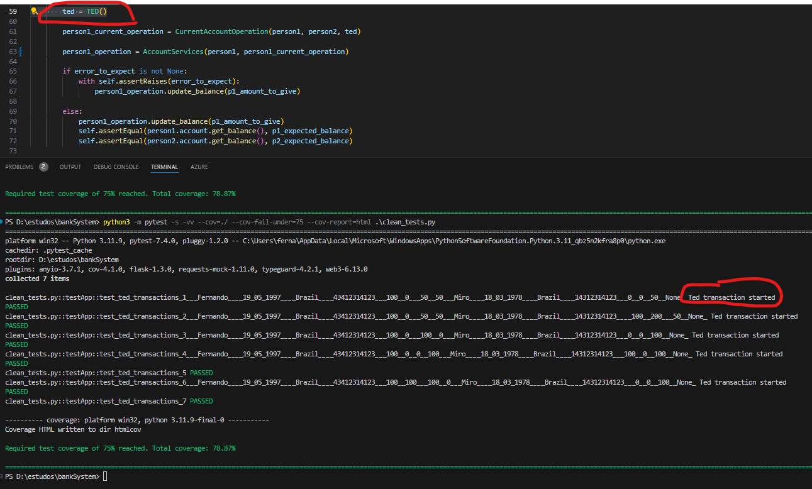
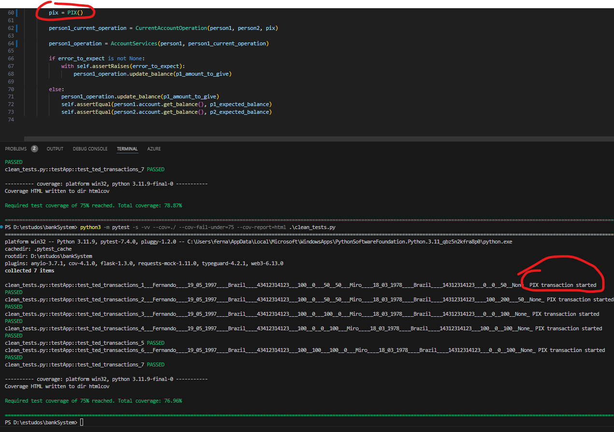

# Testes com o metodo TED

Veja que a instancia é passada para ao tipo de conta

# Podemos facilmente mudar o tipo de transação (em produção claramente teriamos um factory) sem mudar mais nada no sistema

